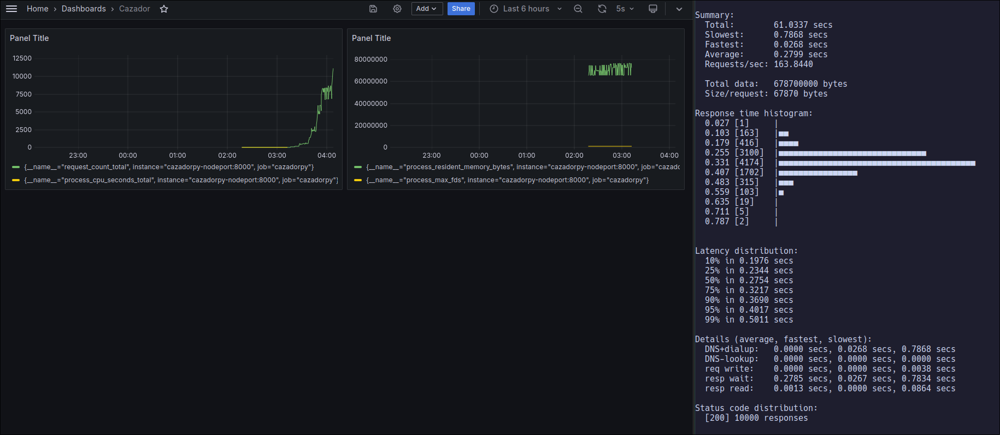

## Sobre

Cazador é um projeto desenvolvido em Python que atua como um scraper de sites de imóveis. O objetivo principal é coletar informações relevantes de páginas de imóveis e salvá-las em um banco de dados MongoDB para futuras consultas ou análises. Este projeto é especialmente útil para quem busca automatizar a coleta de dados em sites imobiliários, proporcionando uma maneira eficiente de acessar informações atualizadas sobre imóveis disponíveis.

https://github.com/carlosarraes/cazador/assets/106715016/ab758400-3e0a-4d54-8cec-4a996c690c75

## Funcionalidades

- _Atualização do Banco de Dados_: Através do endpoint /update, é possível disparar o processo de scraping que coleta dados dos sites configurados e os salva no banco de dados MongoDB. Este processo pode ser automatizado ou executado manualmente conforme a necessidade.
- _Consulta de Imóveis_: O endpoint GET / permite listar os imóveis que foram previamente coletados e salvos no banco de dados, facilitando a visualização e acesso às informações de interesse.
- _Debug de Scraping_: O endpoint /debug executa o processo de scraping de forma isolada para um imóvel específico e retorna o objeto parseado. Este endpoint é particularmente útil para verificar a correta extração e parsing dos dados em desenvolvimento ou em processos de manutenção.

## Monitoramento com Grafana e Prometheus

Para garantir a saúde e o desempenho adequados da aplicação, o Cazador utiliza Grafana e Prometheus para monitoramento. Essas ferramentas permitem acompanhar métricas importantes da aplicação e do ambiente de execução, como uso de CPU, memória, número de requisições e tempo de resposta.

- _Prometheus_: Configurado para coletar métricas da aplicação, especialmente focado nos endpoints /healthz e /readyz, que indicam, respectivamente, a saúde geral da aplicação e sua prontidão para receber tráfego.
- _Grafana_: Integrado ao Prometheus, oferece dashboards visuais que facilitam o acompanhamento das métricas coletadas, permitindo uma visualização rápida e eficiente do estado da aplicação.

## Dependências

- Docker
- Kubectl
- Minikube (local, com docker)
- Hey (para stress test)

## Setup

- Clone este repositório `git clone https://github.com/carlosarraes/cazadorpy.git`
- Construa a imagen do docker `docker build -t carlosarraes/cazadorpy:latest .`
- Inicialize o Minikube `minikube start`
- Aplique as configuracões do k8s: `kubectl apply -f k8s/`
- Utilize o endpoint /update: Após a aplicação dos arquivos de configuração do Kubernetes, o serviço estará pronto para uso. (Ache o ip com Minikube ip, o endpoint estará exposto n porta 30007)
- Vá no Grafana `minikube service grafana --url`, adicione prometheus como data source `http://prometheus:9090`, crie uma dashboard, e uma das configuracões que coloquei manualmente no python foi um middleware de count

## Próximos passos

- Implementar a coleta de todas as páginas com base na quantidade inicial de imóveis encontrados.
- Atualmente, as 4 réplicas consultam o mesmo endpoint. Planeja-se permitir que o controle do endpoint especifique o bairro, direcionando assim a busca de cada réplica para evitar sobreposições.
- Aprimorar o controle sobre a paginação e a faixa de preço dos imóveis.
- Expandir o número de scrapers para abranger diferentes sites de imóveis.
- Desenvolver uma interface básica para facilitar a visualização dos dados.

## Jenkins Pipeline

Para automatizar o processo de entrega do projeto Cazador, utilizamos um pipeline Jenkins definido em um Jenkinsfile. Este pipeline abrange a construção da imagem Docker da aplicação, o deployment no Minikube e a atualização do serviço. Aqui está um resumo do processo:

- _Construção da Imagem Docker_: A pipeline inicia construindo a imagem Docker da aplicação a partir do Dockerfile presente no repositório.
- _Deployment no Kubernetes (Minikube)_: Após a construção da imagem, a pipeline aplica as configurações do Kubernetes, presentes no diretório k8s/, usando kubectl. Isso garante que a versão mais recente da aplicação seja implantada no Minikube.
- _Jenkinsfile_: Inclua o arquivo Jenkinsfile no seu repositório Git para definir estas etapas. As configurações específicas de build e deploy podem ser ajustadas conforme o seu ambiente e necessidades.

Utilizar um pipeline Jenkins simplifica e automatiza o processo de entrega, garantindo que as atualizações sejam facilmente e consistentemente aplicadas ao ambiente de desenvolvimento ou produção.

## Stress Test

Para avaliar a capacidade de sua aplicação sob condições de carga elevada, você tem duas opções para realizar o teste de estresse utilizando a ferramenta Hey.

### Usando o script

- Permissões de Execução `chmod +x stress_test.sh`
- Execução do Script `./stress_test.sh [número de requisicões]`

###### Este script verifica se as ferramentas necessárias (hey e minikube) estão instaladas e executa o teste de estresse no endpoint configurado.

### Usando Hey diretamente

Caso prefira, você pode também executar o comando hey diretamente no terminal, especificando o número de requisições desejadas e o endereço do serviço. Substitua <endereço-do-serviço-no-minikube> e <porta> pelos valores correspondentes ao serviço exposto pelo Minikube:

`hey -n 1000 http://<endereço-do-serviço-no-minikube>:<porta>/`
